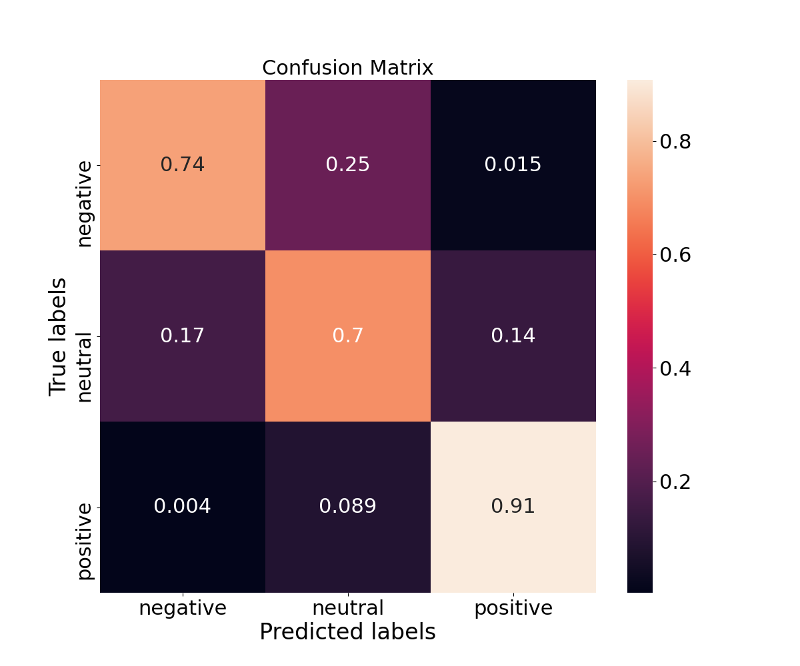
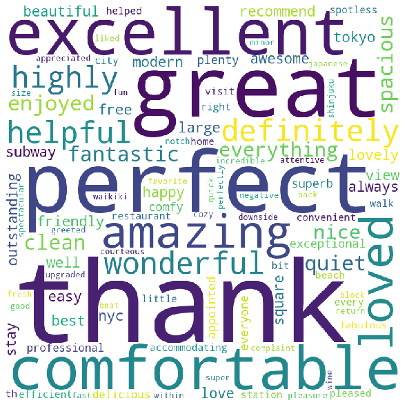
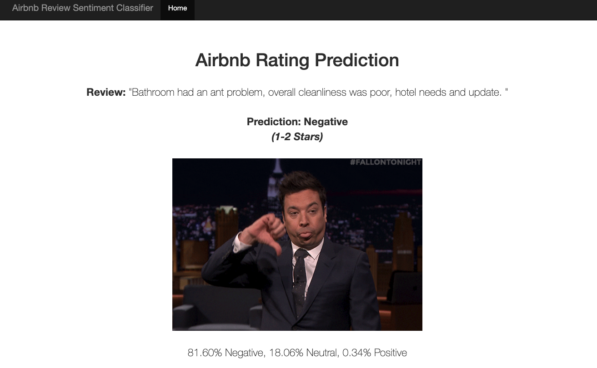
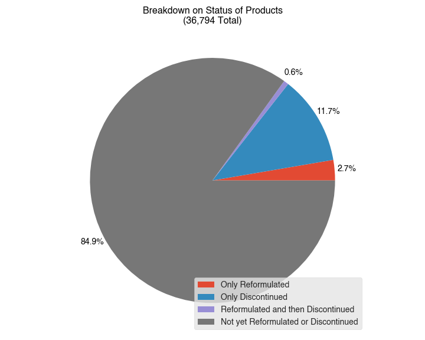
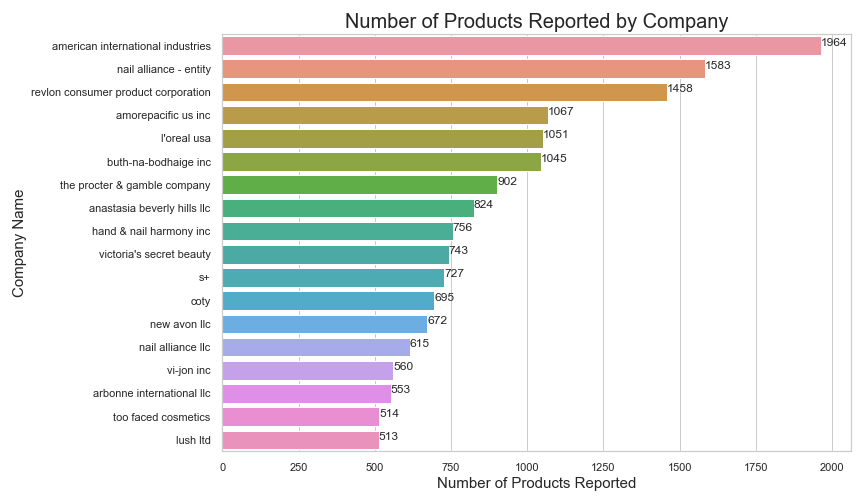
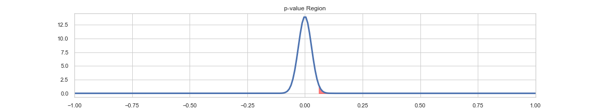

# Data Science Portfolio 
---

This portfolio includes my featured individual projects as well as group case studies completed in teams of 4-5. Additionally, the slide decks available per project were created and presented to audiences of over 20 to 50 people that included data science instructors, peers, and members of the community.

___
## Table of Contents
### 1. [Featured Individual Projects](#Featured-Individual-Projects)
* [Between the Lines of Tripadvisor Hotel Reviews](#between-the-lines) - NLP & Sentiment Classification
* [What's In My Makeup Bag?](#makeup) - Hypothesis Testing

### 2. [Group Case Studies](#Group-Case-Studies)
* [Detecting Fraud](#fraud) - Model Deployment
* [Recommending Movies](#movie-rec)
* [IMDB Movie Review Sentiment Prediction](#imdb)
* [Reducing Churn with Supervised Learning](#churn)
* [Predicting Sale Price of Auction Machinery](#price) - Regression
* [Macron vs Le Pen Through Tweets](#spark) - Spark EDA

### 3. [Resume](#Resume)
___
# Featured Individual Projects 

<h2><a href="https://github.com/chelseanbr/between-the-lines-hotels" name="between-the-lines">Between the Lines of Tripadvisor Hotel Reviews</a>
</h2>
 

<iframe src="https://docs.google.com/presentation/d/e/2PACX-1vQFJKpAtyG1DyWcIr2IuS7U5TQpnbagtCrRjk8eB05t7L7xkPNmUgTRIFEmAih0ylVdqw7MwNkSDw1P/embed?start=true&loop=true&delayms=5000" frameborder="0" width="480" height="299" allowfullscreen="true" mozallowfullscreen="true" webkitallowfullscreen="true"></iframe>

<h3>Summary</h3> 
The duration of this project was about 2 weeks and it was managed through <b>agile scrum meetings.</b> I scraped 1.2 million Tripadvisor hotel reviews in 4 days to build a sentiment classifier. Then, after data preprocessing and EDA, I built and evaluated over 6 different models on their confusion matrices and improved accuracy from <70% to 88%. Finally, I deployed a long short-term memory neural network to a <a href="http://tinyurl.com/rating-predictor">web app</a> running in a TensorFlow Docker container on an AWS EC2 instance. For more details, please check out the <a href="https://github.com/chelseanbr/between-the-lines-hotels">GitHub Repo</a> and <a href="https://docs.google.com/presentation/d/1nZ9morIyqlIuJPOEAuhNwTw9m3lByksouw4KqXlmOfQ/edit?usp=sharing">Google Slides.</a>
  
<h3>Technologies</h3> 

<b>AWS EC2, Docker, Flask,</b> Jupyter Notebook, Python and libraries: <b>TensorFlow/Keras, NLTK, Scikit-Learn, BeautifulSoup4,</b> Pandas, NumPy, Matplotlib, Seaborn
  

  

<h3>
 
<a href="http://tinyurl.com/rating-predictor">[ Check out the Web App! ]</a>

</h3>
 

 
<h2><a href="https://github.com/chelseanbr/Whats-In-My-Makeup-Bag" name="makeup">What's In My Makeup Bag?</a>
</h2>
 

<iframe src="https://docs.google.com/presentation/d/e/2PACX-1vTqn3CU68sORWuVN4KVUne7gcbFL3aqZDcczq8rlgDTRfQE_RDncapGnUQHfdBhGhSKOz6PbxJag41i/embed?start=true&loop=true&delayms=5000" frameborder="0" width="480" height="299" allowfullscreen="true" mozallowfullscreen="true" webkitallowfullscreen="true"></iframe>

<h3>Summary</h3>
This project lasted 1 week and it was also managed through agile scrum meetings. I cleaned and performed EDA on >100,000 harmful cosmetic product records. Then, I conducted hypothesis testing using Welch's t-test and found statistically significant differences across similar companies in their ratios of discontinued or reformulated products to harmful products reported. Please check out the <a href="https://github.com/chelseanbr/Whats-In-My-Makeup-Bag">GitHub Repo</a> and <a href="https://docs.google.com/presentation/d/1D423buf9mRmoyYd_Y_Px--UYyISzgiUIupycwaf3miw/edit?usp=sharing">Google Slides</a> for more info.
  
<h3>Technologies</h3> 

<b>SciPy</b>, Pandas, Matplotlib, Seaborn, Jupyter Notebook
  

  

  

---
# Group Case Studies 
Thanks to my fellow teammates at Galvanize!
  

<h2><a href="https://docs.google.com/presentation/d/1N7TDh3B01rEnUJEVcMnRda2Aj2pg0AVLp4S5C2i6NK8/edit?usp=sharing" name="fraud">Detecting Fraud</a>
</h2>
 
<iframe src="https://docs.google.com/presentation/d/e/2PACX-1vQOkGCa9-K4tLePO77LtGgm4FxW0Z3qiiG_sPUP6yTcbkfEIFgRora3KKZUpVZhhYKLSf_IVGYIQKie/embed?start=true&loop=true&delayms=5000" frameborder="0" width="480" height="299" allowfullscreen="true" mozallowfullscreen="true" webkitallowfullscreen="true"></iframe>

<h3>Summary</h3>
Over the course of roughly 12 hours split into two days, my team had to train and deploy a fraud classification model to a Flask web app. We performed EDA, feature engineering, double-checked for any data leakage, and handled class imbalance with undersampling. Our metrics were recall and ROC AUC to minimize false negatives. We used Grid Search for hyperparameter tuning and 5-fold cross-validation for model evaluation. Our best model was a Random Forest with test recall of 0.92 and ROC AUC of 0.98. Finally, we deployed the model, analyzed feature importances, and came up with business actions for low/medium/high risk fraud.
  
<h3>Technologies</h3> 
<b>Flask</b>, AWS EC2, Docker, Scikit-Learn, Pandas, Matplotlib, MongoDB, Jupyter Notebook

  

<h2><a href="https://docs.google.com/presentation/d/10mxPJzqnq_YypwsjY20M1ZftKIaZDRyxxnlbfJ-zcMk/edit?usp=sharing" name="movie-rec">Recommending Movies</a>
</h2>
 
<iframe src="https://docs.google.com/presentation/d/e/2PACX-1vQuKXOx91joVLAbEmPRidFWk2BHPn03pPh4IPw8_FyN8ubMTcp_FAyllMQY9fFW1m3z3StP-Wnzibo5/embed?start=true&loop=true&delayms=5000" frameborder="0" width="480" height="299" allowfullscreen="true" mozallowfullscreen="true" webkitallowfullscreen="true"></iframe>

<h3>Summary</h3>
My team had roughly 12 hours split into two days to build a recommender system for movies using a MovieLens dataset. We performed EDA and found that we had a very sparse utiliy matrix. Due to the cold-start problems we faced, we used k-means to cluster movies by genre and users by demographics to build the movie recommender for users within the whole dataset. With more time, we would have tried to use matrix factorization with Spark ALS.
  
<h3>Technologies</h3> 
<b>Scikit-Learn</b>, Pandas, Matplotlib, Seaborn, Jupyter Notebook

  

<h2><a href="https://docs.google.com/presentation/d/157sQ8w0JysUSefijpaAORrjJrGq6SzjHdJTTeXWeoEQ/edit?usp=sharing" name="imdb">IMDB Movie Review Sentiment Prediction</a>
</h2>
 
<iframe src="https://docs.google.com/presentation/d/e/2PACX-1vR2Udm3MjXwDG3ScwIBlHsgD_baZg0HbidxYYwhP2mfonyPwOO8GPIwthRH-g05fUgVyJHPNd3JO5wH/embed?start=true&loop=true&delayms=5000" frameborder="0" width="480" height="299" allowfullscreen="true" mozallowfullscreen="true" webkitallowfullscreen="true"></iframe></iframe>

<h3>Summary</h3>
This case study took place over roughly 6 hours in one day. We used natural language processing (NLP) to classify IMDB movie reviews as either positive or negative (neutral reviews were excluded from our dataset). We explored how different NLP techniques affected model scores and ended up with a logistic regression performing the best using a Snowball stemmer and TF-IDF features.
  
<h3>Technologies</h3> 
<b>NLTK</b>, Scikit-Learn, Pandas, Matplotlib, Seaborn, Jupyter Notebook

  

<h2><a href="https://docs.google.com/presentation/d/1g_H1GpfpihiBeJgSnZp61ADMddcC-JJz55yjfvi-7Ew/edit?usp=sharing" name="churn">Reducing Churn with Supervised Learning</a>
</h2>
 
<iframe src="https://docs.google.com/presentation/d/e/2PACX-1vR92DxWd7TBQzqmVn8rH6ba0ROeHmVhmFZMkSBp9-7f5c2LBS7yncTq-0Jz9cigact8C5IuPjb-bCgN/embed?start=true&loop=true&delayms=5000" frameborder="0" width="480" height="299" allowfullscreen="true" mozallowfullscreen="true" webkitallowfullscreen="true"></iframe>

<h3>Summary</h3>
Approximately 6-hour (one day) EDA & modeling case study to reduce churn.
  
<h3>Technologies</h3> 
<b>Scikit-Learn</b>, Pandas, Matplotlib, Jupyter Notebook

  

<h2><a href="https://docs.google.com/presentation/d/1WVcawr_99BM5hdVz6aZ9d_Y0-LYXF1_aV_Y_5RDlv5A/edit?usp=sharing" name="price">Predicting Sale Price of Auction Machinery</a>
</h2>
 
<iframe src="https://docs.google.com/presentation/d/e/2PACX-1vRI1uOecWy70Yo34aBiIIXx7DIICYlNu5joIgpaHjpiLNqwNb8xpIXnOGet_jmgWMNA4qrn03Tq3a1Y/embed?start=true&loop=true&delayms=5000" frameborder="0" width="480" height="299" allowfullscreen="true" mozallowfullscreen="true" webkitallowfullscreen="true"></iframe>

<h3>Summary</h3>
Roughly 6-hour (one day) EDA & modeling case study to predict sale price with regression.
  
<h3>Technologies</h3> 
<b>Scikit-Learn</b>, Pandas, Matplotlib, Jupyter Notebook

  

<h2><a href="https://docs.google.com/presentation/d/1DP2IOl3nunOTMZe26R-GYc3B_nZu7AHivER2wIWtxoQ/edit?usp=sharing" name="spark">Macron vs Le Pen Through Tweets</a>
</h2>
 
<iframe src="https://docs.google.com/presentation/d/e/2PACX-1vT7M0tRBZSXJCp55UsruBZwxs2Vyr8voA8_5S1h9IuwSduvsJYAytW4z2lSEfdNzpNFlqF16v2nVfHd/embed?start=true&loop=true&delayms=5000" frameborder="0" width="480" height="299" allowfullscreen="true" mozallowfullscreen="true" webkitallowfullscreen="true"></iframe>

<h3>Summary</h3>
Approximately 6-hour (one day) EDA to also try out using Spark.
  
<h3>Technologies</h3> 
<b>Spark (PySpark)</b>, Pandas, Matplotlib, Jupyter Notebook

  

___
 

### More projects to come!
 

---
# Resume  
<iframe width="100%" height="600" src="https://docs.google.com/gview?url=https://github.com/chelseanbr/chelseanbr.github.io/raw/editing/pdf/Chelsea_Ramos_Resume.pdf&embedded=true" loading="eager"></iframe>

  

[[ Back to Top ]](#Data-Science-Portfolio)